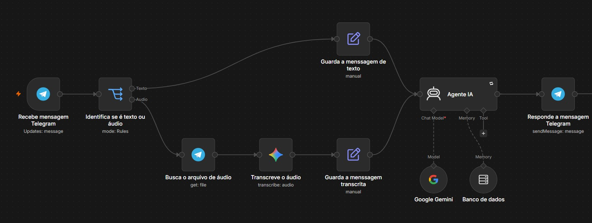

# Agente Virtual de Atendimento: TechByte Eletrônicos

## Visão Geral
Este projeto consiste em um fluxo de automação desenvolvido na plataforma n8n. O sistema atua como um assistente virtual operando via Telegram para uma loja de eletrônicos fictícia. Utilizando Inteligência Artificial, o bot é capaz de interagir com clientes, processar mensagens de voz, recomendar produtos de um catálogo predefinido e responder a dúvidas logísticas e financeiras.

### Testes de Estabilidade e Execução
*(Monitoramento de logs, sucesso nas requisições do Telegram)*

## Arquitetura do Sistema
O fluxo foi estruturado para garantir escalabilidade e tratamento eficiente de diferentes formatos de entrada de dados.

* **Recepção (Trigger):** Captura de novas mensagens enviadas pelo usuário via Trigger do Telegram.
* **Roteamento Dinâmico:** Um nó condicional (Switch) avalia o pacote de dados e direciona o fluxo com base no formato da mensagem (Áudio ou Texto).
* **Processamento de Áudio:** Arquivos de voz são baixados da API do Telegram e enviados ao modelo Google Gemini para transcrição (Speech-to-Text).
* **Agente IA Core:** O texto processado alimenta um Agente baseado no modelo Gemini 3.5-flash. O agente é instruído por um System Prompt rigoroso para assumir a persona de um consultor de vendas, limitando suas ofertas a um catálogo de 10 produtos e regras de negócio específicas.
* **Memória de Contexto:** Utilização de uma janela de buffer (Buffer Window Memory) para armazenar o histórico recente da conversa, permitindo que a IA retenha o nome do cliente e o contexto da negociação.
* **Resposta:** Envio da saída processada de volta à interface do Telegram.

## Tecnologias Integradas

| Tecnologia | Função no Projeto |

| **n8n** | Orquestração do fluxo, tratamento de variáveis e gestão de credenciais. |
| **Telegram API** | Interface de comunicação (Frontend) com o usuário final. |
| **Google Gemini API** | Processamento de Linguagem Natural (LLM) e transcrição de mídias. |

## Funcionalidades e Resiliência
* **Suporte Omnichannel Básico:** Capacidade de interpretar comandos de voz com a mesma precisão de comandos em texto.
* **Prevenção de Alucinação:** Instruções de sistema configuradas para restringir a atuação da IA ao catálogo fornecido, evitando a invenção de produtos ou promessas irreais.
* **Tratamento de Quedas de API:** O nó do modelo de linguagem está configurado com a diretriz "Retry On Fail". Em caso de limitação de taxa (Rate Limit) ou sobrecarga temporária dos servidores do Google, o sistema aguarda um intervalo de tempo e repete a requisição de forma invisível para o usuário final, evitando o encerramento prematuro do fluxo.

**Conecte-se comigo:**
[LinkedIn](https://www.linkedin.com/in/pacheco-renato/)
